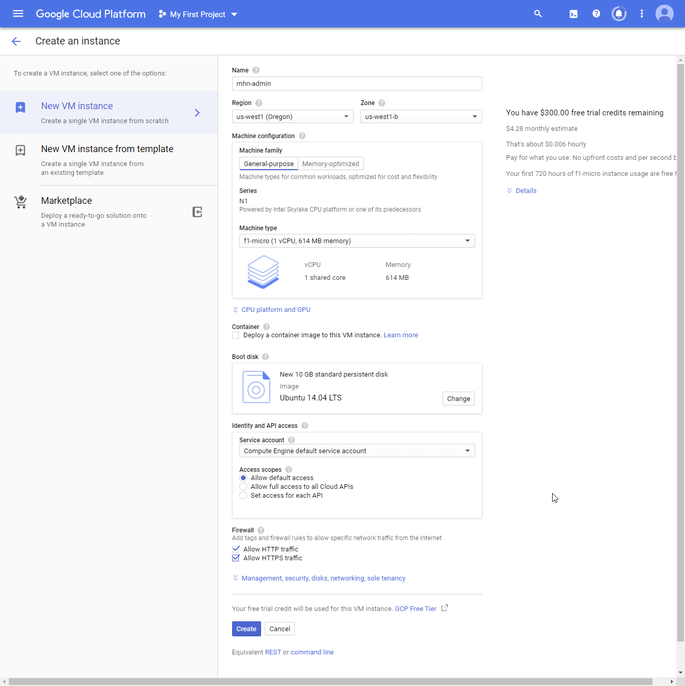
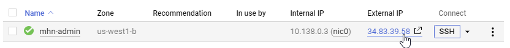

# Weeks 10 & 11 Project: Honeypot

**Summary**: Setup a honeypot and intercept some attempted attacks in the wild.


## Background
A honeypot is a decoy application, server, or other networked resource that intentionally exposes insecure features which, when exploited by an attacker, will reveal information about the methods, tools, and possibly even the identity of that attacker. Honeypots are commonly used by security researchers to understand the threat landscape facing developers and system administrators, collecting data that might include:

+ Information about sources of malicious network traffic such as IP addresses, geographic origin, targeted ports, etc.
+ Information used to harden resources against email spammers
+ Malware samples
+ DB vulnerabilities such as SQLI techniques

There are two broad categories of honeypots:
+ **Low-interaction honeypots** provide simulations of target resources, typically using emulation or virtualization, to reduce resource consumption, simplify configuration and deployment, and provide solid containment features
+ **High-interaction honeypots** expose non-simulated target resources in a way that more closely imitates a production environment to attract more sophisticated attackers and understand more complicated exploitation routes

For example, a low-interaction honeypot might emulate a server capable of accepting SSH connections through a combination of exposed ports and decoy responses, whereas the high-interaction version would feature an actual SSH server possibly misconfigured in some way that makes it vulnerable. In the low-interaction example, attempted exploitation would quickly lead to a dead end for the attacker, perhaps revealing only an IP address and a few attempted commands to the honeypot's maintainer. In the high-interaction example, the attacker would potentially be able to compromise the server, wasting more time and giving away more information about his or her goals.

## Overview
In this assignment, you will stand up a basic honeypot and demonstrate its effectiveness at detecting and/or collecting data about an attack. Guided instructions for doing this using specific software are provided below, but you are free to take any approach you wish that demonstrates the following basic principles:

Successful configuration and deployment of a network-accessible honeypot server with two primary features:
++ An attack surface that is vulnerable or exposed in some way to network-based attacks
+ A network security feature such as an IDS configured to detect and log such attacks
Illustration of at least one attack against the honeypot that can be detected or logged in a way that captures information about the attack or the attacker
<hr>

# Walkthrough
Keeping in mind that there are many ways one could fulfill the above requirements, in this section, we will walkthrough a basic honeypot deployment using a well-supported open source honeypot: [Modern Honey Network](https://github.com/pwnlandia/mhn) (MHN). MHN's architecture is modular and extensible and comes with many options for deploying different types of honey pots. In MHN architecture, there is a single admin VM which is used to deploy, manage and collect information from the honeypots, which are deployed as separate VMs. Thus to run MHN, we'll need to setup at least two VMs: the single **Admin VM** and at least one **Honeypot VM**.

## Milestone 0: To the Google Cloud!
To complete this assignment, you'll need access to a cloud hosting provider to provision the VMs. Many providers offer time-limited free trial accounts with resource limitations, and you should easily be able to complete the requirements for this assignment within these limitations -- though you may need to ensure you cleanup before your trial period expires. The setup we'll walkthrough below has been tested to work with standard sized VMs. Running MHN Admin on micro size VM's is not recommended.

You can use any cloud provider to which you already have access or that offers a free trial, though you'll need to be familiar with its usage and / or limitations. If you're not sure where to start, we recommend [Google Cloud Platform's Free Tier](https://cloud.google.com/free/), and while we'll provide general guidelines that should work with most cloud providers, the instructions below will also show insets labeled **GCP Users** with commands and settings specific to Google Cloud Platform. If you are confident about working with an alternate cloud provider such as AWS feel free to adapt the below instructions accordingly. If this is your first foray into the world of cloud computing, consider starting a GCP trial so you can follow the more specific instructions below.

## Setting up your GCP environment
You will complete some of the initial setup steps in the Web UI for GCP. This should give you a feel for the tools and functionality GCP provides.

1. Navigate to https://console.cloud.google.com/. Log on if necessary.

    If you have multiple Google Accounts, make sure you are signed in with the account you would like ot use for this project.
    
2. Click the **TRY FOR FREE** button.
    Fill out the information including providing a credit card number. The VMs you create for this project will not use up even 25% of your free credits if you create them as described here and only run them for a week or 2. Google will not autocharge you if you go over your limit.
  
  Once you are enrolled you will land on the Welcome page.
  
3. Create a new project for this assignment.
    1. Click the **My First Project** menu to bring up a list of your projects.
    1. Click the **NEW PROJECT** button.
    1. Give the project a name and click **CREATE**.
    You will see a notification that the project is being created. This may take a minute.
    
4. Click the **GO TO COMPUTE ENGINE** link. You will use this page to create your VMs. It may take a few minutes to prepare your Compute Engine.

## Milestone 1: Create MHN Admin VM
**Summary:** Start by creating the MHN Admin VM via your cloud provider. The VM needs to have an internet-facing IP and accessible to you via SSH. The MHN Admin VM will be provisioned with the following attributes:

+ Ubuntu 18.04 Minimal
+ HTTP traffic allowed (port 80)
+ TCP ports 3000 and 10000 need to be open to allow incoming (aka 'ingress') traffic for geolocation and honeypot sensor data.

That last requirement is generally the only one that may require a specific firewall rule to configure properly, because those ports are non-standard and specific to MHN. Some cloud providers may require you to create the firewall rules separately and then apply them to the VM. Either way, make sure when you create the VM that you can access it via SSH.

1. Create the VM in the Web UI. 
    1. Click the **Create** button to create a new VM. You will create a VM to administrate the honeypot project.
    1. Name the VM *mhn-admin*. This specific name is important because you will copy and paste commands later in the setup that refer to this VM name.
    1. Set the **Region** to us-west 1. The Zone will automatically update to a related zone, such as us-west1-b.
    1. Change the **Machine type** to f1-micro. Creating the correctly sized system means you do not waste your compute credits on systems that are more powerufl than you need.
    1. In the **Boot disk** seciton, click the **Change** button. 
    1. Choose the **Ubuntu 14.04 LTS** image, then click **Select**.
    1. In the **Firewall** section, select the boxes for **Allow HTTP traffic** and **Allow HTTPS* traffic.
    1. Expand the **Management, security, disks, networking, sole tenancy** section.
        1. On the **Networking** tab, add a Network tag for *mhn-admin*.
  
    1. Click **Create**.
  
2. Configure your firewall rules. You can do this in the Web UI, but it's faster to do through the console.
    1. Click the **Access Cloud Shell** button in the header bar of GCP. 
  
  
        1. Review the description: "Google Cloud Shell provides you with command-line access to your cloud resources directly from your browser. You can easily manage your projects and resources without having to install the Google Cloud SDK or other tools on your system."
        1. Click **Continue**.
        
Alternatively, you can [download and install the GCP SDK](https://cloud.google.com/sdk/docs/quickstarts) so you can SSH directly to youur environment.

    2. Run the following commands in the SDK to create the appropriate firewall rules.
    
        * Each comand spans several lines. 
        * Note the target-tags point at the mh-admin VM you created above.
        * Each command will take a minute to run.

```
    gcloud compute firewall-rules create honeymap \
    --allow tcp:3000 \
    --description="Allow HoneyMap Feature from Anywhere" \
    --direction ingress \
    --target-tags="mhn-admin"
```

```
    gcloud compute firewall-rules create hpfeeds \
    --allow tcp:10000 \
    --description="Allow HPFeeds from Anywhere" \
    --direction ingress \
    --target-tags="mhn-admin"
 ```
 
   3. (Optional) Review the firewall rules you created.
        * In the Web UI:  
            1. Click on the vm you created, mhn-admin to see details of the VM.
            1. In the **Network Interfaces** section, click View details.
            1. In the left VPC network menu, click **Firewall rules.**
            1. You will see the *hpfeeds* and *honeymap* rules you created.
            Navigate back to the VM instances page so you are in the correct place for the next step.
        * In the Cloud shell, run the command:
     
```
    gcloud compute firewall-rules list --format="table(
    name,
    network,
    direction,
    priority,
    sourceRanges.list():label=SRC_RANGES,
    allowed[].map().firewall_rule().list():label=ALLOW,
    targetTags.list():label=TARGET_TAGS,
    disabled
    )"
    
     
 ```
 
 
## Milestone 2: Install the MHN Admin Application
**Summary:** You have created a VM to administrate your honeypot network, but it's just a shell. In this step you will install the server software. 

**Note:** This step may take 30-40 minutes overall. These instructions were adapted from the [MHN README](https://github.com/pwnlandia/mhn)

1. Access them VM through the command line. Click the SSH button next to your mhn-admin VM to open an SSH terminal in your browser.
[Screenshot of accessing SSH terminal from Computer instances page](https://github.com/sarcox/CP-HoneyPot-Instructions/blob/master//GCP-mhn-admin-SSH.png)
2. Update the VM with latest packages and install some dependencies:

 ```
    sudo apt update
    sudo apt install git python-magic -y
 ```
 
3. Download MHN and install:

```
    cd /opt/
    sudo git clone https://github.com/pwnlandia/mhn.git
    cd mhn/
    sudo ./install.sh
```

This will start the script running and it will take a while (approximately 20 minutes) to complete the first part.

  1. At the first set of prompts, complete the information as follows:
  
    *Do you wish to run in Debug mode? y/n :* **n**
    *Superuser email*: You can use any email -- this will be your username to login to the admin console.
    *Superuser password*: Choose any password -- you'll be asked to confirm.
    
        Make a note of this username and password or you will not be able to access the server you set up in your browser!
  
  2. You can accept the default values for the rest of the values by hitting enter. Answer n for any y/n prompts:
  
    Server base url ["http://#.#.#.#"]:
    Honeymap url ["http://#.#.#.#:3000"]: 
    Mail server address ["localhost"]:
    Mail server port [25]: 
    Use TLS for email?: y/n n
    Use SSL for email?: y/n n
    Mail server username [""]:
    Mail server password [""]:
    Mail default sender [""]:
    Path for log file ["/var/log/mhn/mhn.log"]:

  3. The script will churn for another 15 minutes or so, and near the end, there will be two more y/n prompts, both of which you can answer n:

    Would you like to integrate with Splunk? (y/n) n
    Would you like to install ELK? (y/n) n

  4. Last question ...

    Would you like to add MHN rules to UFW? (y/n) n

Now you should be able to load the external IP in a browser and login to the admin console via the "superuser" values you chose above. Have a look around the UI to get oriented; there won't be any data available as we've not deployed any honeypots yet.

## Milestone 3: Create a MHN Honeypot VM
The admin system you installed simply supports managing honeypots. Now, you need to create one or more honeypots to capture data on attackers. MHN supports multiple honeypots, each of which has a slightly different purpose you can read about. 

For each honeypot you will create a VM and a specific firewall rule for that VM. Previously you used the GUI to create a VM and the command line to create the VM rules. In this step, you will use the command line for both, which is quicker.

1. Create the firewall rule to allow incoming TCP and UDP traffic on all ports for honeypot sensors:

```
    gcloud compute firewall-rules create wideopen \
    --description="Allow TCP and UDP from Anywhere" \
    --direction ingress \
    --priority=1000 \
    --network=default \
    --action=allow \
    --rules=tcp,udp \
    --source-ranges=0.0.0.0/0 \
    --target-tags="honeypot-1,honeypot-2,honeypot-3"
```

2. Create the VM for our honeypot, called honeypot-1:

```
    gcloud compute instances create "honeypot-1" \
    --machine-type "n1-standard-1" \
    --subnet "default" \
    --maintenance-policy "MIGRATE" \
    --tags "honeypot" \
    --image "ubuntu-minimal-1804-bionic-v20191024" \
    --image-project "ubuntu-os-cloud" \
    --boot-disk-size "10" \
    --boot-disk-type "pd-standard" \
    --boot-disk-device-name "honeypot-1"
```

This VM will require different ports open, though which ones depend on the specific honeypot being used. To keep things simple, for this VM (and any additional honeypot VMs you create), simply allow incoming traffic from all ports and protocols. Again, this will likely require a firewall rule.

## Milestone 4: Install the Honeypot Application
You have the system for your honeypot, but now you need to configure it to attract attackers. MHN makes this straightforward. 
1. Access the install script for your honeypot through the MHN server you have deployed.
    1. Log on to the mhn-admin system in the browser, so you can use the Web UI. Copy the External IP of your system and paste into a browser tab. If the page fails to load, make sure you are using the HTTP protocol and not HTTPS.
    
    2. Log on with the email and password you configured before.
    3. Click **Deploy** in the top nav, and choose a script. For your first VM, choose **Ubuntu/Raspberry Pi - Dionaea**.
    4. Copy the  Deploy Command appear shown.  This is a line comthe mand to execute inside the honeypot VM to configure it properly. It starts with *wget*.
    
2. Use the install script to configure the honeypot-1 VM. 
    1. From the Compute Engine page, click the **SSH** button next to your *honeypot-1* VM to open an SSH terminal in your browser.
    2. Paste the command you copied in the previous step and execute it.
    This step should only take a few minutes to complete. Complete any prompts that the install script presents.
3. Return to the Web UI of mhn-admin server and confirm the installation. Click **Sensors > View Sensors** sensors and you should see the new honeypot listed.

## Milestone 5: Attack!
Now for the fun part: let's attack the honeypot to make sure it's all working. You can use nmap in Kali Linux and pass it the IP of the honeypot VM (not the IP of the MHN Admin VM):

''''
    nmap -A -T4 35.225.x.x
    Starting Nmap 7.80 ( https://nmap.org ) at 2019-11-18 01:34 CST

    map scan report for x.x.225.35.bc.googleusercontent.com (35.225.x.x)

    Host is up (0.0059s latency).

    Not shown: 992 filtered ports

    PORT     STATE SERVICE  VERSION

    21/tcp   open  ftp      Synology DiskStation NAS ftpd

    ...

    Nmap done: 1 IP address (1 host up) scanned in 239.62 seconds

''''

It should show multiple ports open...these are the services Dionaea is using to attract attackers. Switch back to the MHN Admin console in your browser, and from the top nav, choose Attacks. If everything goes well, you should see your IP address listed with several port scan records. This means the honeypot intercepted your attack.

You may, however, see other attacks as well, from other IPs. In fact, it shouldn't take long at all for this to happen. Port scans should start coming in at an alarming rate, from all over the world, and even with only a single honeypot deployed, MHN will start collecting lots of data. Welcome to the hostile territory that is the Internet.

## Milestone 6: More HoneyPot
Repeat the steps for Milestone 4 and 5 with slight modifications.

The commands below create a VM with the name "honeypot-2." To create more VMs, update that piece with something different, e.g. honeypot-3.

```
    You don't need to add a firewall rule for this VM because the *wideopen* firewall rule you created had tags for honeypot-2 and honeypot-3. 
```    

2. Create the VM for our honeypot, called honeypot-2:

```
    gcloud compute instances create "honeypot-2" \
    --machine-type "n1-standard-1" \
    --subnet "default" \
    --maintenance-policy "MIGRATE" \
    --tags "honeypot" \
    --image "ubuntu-minimal-1804-bionic-v20191024" \
    --image-project "ubuntu-os-cloud" \
    --boot-disk-size "10" \
    --boot-disk-type "pd-standard" \
    --boot-disk-device-name "honeypot-2"
```

3. Log on to the Web UI of the mhn-admin VM to access the install script for another honeypot type. Click **Deploy** in the top nav, and choose a script. Copy only the command, which starts with *wget*
    
4. SSH to the _honeypot-2_ VM to run the install script. 
 
5. Return to the Web UI of mhn-admin server and confirm the installation. Click **Sensors > View Sensors** sensors and you should see the new honeypot listed.

## Milestone 7 Write it up

After you are finished gathering data, you need to export the sensor database to a JSON file to turn in with your assignement. You can push it directly to your Git repository.

*** You need to have set up your Git Repository for the HoneyPot Project before you do this step. ***

1. SSH to the mhn-admin system.
2. Run the following commands to export your data to JSON and add it to your git repo. Substitute your git username and git repository name anywhere you see <>.
    #mongoexport --db mnemosyne --collection session > session.json
    #git config --global user.email "<git username>@users.noreply.github.com"
    #git clone https://github.com/ <git username>/<honeypot-repositoryname> 
    #cp session.json ./<honeypot-repositoryname>/session.json 
    #cd  <honeypot-repositoryname> 
    #git add session.json 
    #git commit session.json -m "Adding json file from MHN server." 
    #git push
    <you will be prompted for your username and password>
3. Write up your findings on the README of the repository, as you have done for previous assignments. 
        # Be sure to create a Private repository and add codepathreview as a collaborator.
        #Include the following details:
            #Which Honeypot(s) you deployed
            #Any issues you encountered
            #A summary of the data collected: number of attacks, number of malware samples, etc.
            #Any unresolved questions raised by the data collected
        #Link to the json export of the data you collected and posted to your Git.
4. Submit the link to your Git Repository on the Assignments page.
